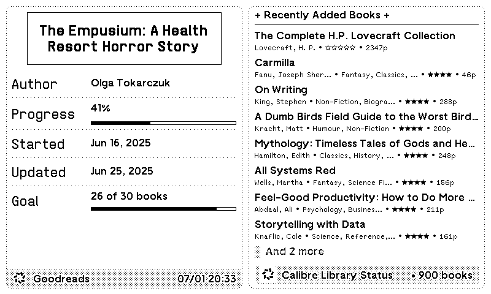

# Calibre Library TRMNL Template Guide

This guide documents the HTML/CSS structure for displaying your Calibre library on TRMNL e-ink devices. All templates are tested and confirmed working with the TRMNL framework.

## Overview

The Calibre Library plugin displays your book collection across four different TRMNL layout sizes:
- **Full**: Complete view with book list and "Book Roulette" suggestion
- **Half Horizontal**: Compact two-column layout
- **Half Vertical**: Tall single-column view  
- **Quadrant**: Minimal quarter-screen display

## TRMNL Framework Basics

TRMNL templates use:
- **HTML structure** without `<head>` tags - only the content inside layout containers
- **Pre-defined CSS classes** from the TRMNL framework
- **Liquid templating** for dynamic data (similar to Shopify)
- **E-ink optimized design** - black and white only, no animations

For complete framework documentation, see: [usetrmnl.com/framework](https://usetrmnl.com/framework)

## Full Layout


The full layout displays a comprehensive view of your library with recently added books and a featured "Book Roulette" suggestion.

### Structure
```html
<!-- Full -->
<div class="layout layout--col layout--stretch-x">
 <div class="w-full"> 
    <!-- Header -->
    <span class="label mb--1">{{ trmnl.user.first_name }}'s Library + Recently Added Books +</span>
    <div class="border--h-2"></div>
   </div>
    <!-- Book List -->
    <div class="list" data-list-limit="true" data-list-max-height="253" data-list-hidden-count="true" data-list-max-columns="1">
      
      
      <div class="item">
        <div class="content">
          <span class="title title--small">{{ book.title }}</span>
          <span class="description">
            {{ book.author | truncate: 30 }} 
            • {{ book.tags | truncate: 30 }}
            • {{ book.rating }}• ☆☆☆☆☆
            • {{ book.page_count }}p
          </span>
        </div>
      </div>
      
      
    </div>
    <!-- Divider -->
    <div class="border--h-2"></div>
    <!-- Book Roulette Section -->
    
    <div class="mb--4">
      <div class="item">
        <div class="content">
          <span class="title title--small">⚄ Book Roulette: {{ book_suggestion.title }}</span>
          <span class="description">
            {{ book_suggestion.author }}
            • {{ book_suggestion.tags | truncate: 80 }}
            • {{ book_suggestion.rating }}• ☆☆☆☆☆
            • {{ book_suggestion.page_count }}p
          </span>
          
          <span class="description clamp--4 mt--1" style="word-break: normal">{{ book_suggestion.description }}</span>
          
        </div>
      </div>
    </div>
    
  </div>
  <!-- Footer/Title Bar -->
  <div class="title_bar">
    
    <span class="title">{{ trmnl.plugin_settings.instance_name }} </span>
    <span class="instance">last updated • {{ current_time }} • {{ total_books }} books</span>
  </div>
</div>
```

### Key Features
- **Personalized header**: Shows user's first name
- **List with overflow**: `data-list-max-height="253"` limits height with automatic scrolling
- **Book Roulette**: Unique to full layout, shows random book with description
- **Metadata display**: Rating stars, page count, truncated tags

### CSS Classes Used
- `layout--col`: Vertical column layout
- `layout--stretch-x`: Stretches content horizontally
- `w-full`: Full width container
- `list`: TRMNL list component with overflow handling
- `border--h-2`: Horizontal divider (2px)
- `mb--1`, `mb--4`: Bottom margin utilities
- `clamp--4`: Limits text to 4 lines

## Half Horizontal Layout


Optimized for side-by-side display with another plugin in a horizontal split.

### Structure
```html
<!-- Half Horizontal -->
<div class="layout layout--col layout--stretch-x">
  <div class="w-full">    
    <!-- Header -->
    <span class="label mb--1">{{ trmnl.user.first_name }}'s Library + Recently Added Books +</span>
    <div class="border--h-1"></div>
  </div>
  <!-- Book List - Added stretch-y class -->
  <div class="list stretch-y" data-list-limit="true" data-list-max-height="150" data-list-hidden-count="true" data-list-max-columns="2">
    
    
    <div class="item">
      <div class="content">
        <span class="title title--small">{{ book.title }}</span>
        <span class="description">
          {{ book.author | truncate: 20 }} 
          • {{ book.tags | truncate: 22 }}
          • {{ book.rating }}• ☆☆☆☆☆
          • {{ book.page_count }}p
        </span>
      </div>
    </div>
    
    
  </div>
  <!-- Footer/Title Bar -->
  <div class="title_bar">
    
    <span class="title">{{ trmnl.plugin_settings.instance_name }} </span>
    <span class="instance">last updated • {{ current_time }} • {{ total_books }} books</span>
  </div>
</div>
```

### Key Differences
- **Two-column list**: `data-list-max-columns="2"` creates side-by-side books
- **Reduced height**: `data-list-max-height="150"` for horizontal space
- **Shorter truncation**: Author (20 chars) and tags (22 chars) for compact display
- **Stretch vertically**: `stretch-y` class maximizes vertical space usage

## Half Vertical Layout



Designed for vertical split screens, maximizing height for more books.

### Structure
```html
<!-- Half Vertical -->
<div class="layout layout--col layout--stretch-x">
  <div class="w-full">    
    <!-- Header -->
    <span class="label mb--1">+ Recently Added Books +</span>
    <div class="border--h-1"></div>
  </div>
  
  <!-- Book List - Added stretch-y class -->
  <div class="list stretch-y" data-list-limit="true" data-list-max-height="375" data-list-hidden-count="true" data-list-max-columns="1">
    
    
    <div class="item">
      <div class="content">
        <span class="title title--small">{{ book.title }}</span>
        <span class="description">
          {{ book.author | truncate: 20 }} 
          • {{ book.tags | truncate: 22 }}
          • {{ book.rating }}• ☆☆☆☆☆
          • {{ book.page_count }}p
        </span>
      </div>
    </div>
    
    
  </div>
  
  <!-- Footer/Title Bar -->
  <div class="title_bar">
    
    <span class="title">{{ trmnl.plugin_settings.instance_name }} </span>
    <span class="instance">• {{ total_books }} books</span>
  </div>
</div>
```

### Key Features
- **Maximum height**: `data-list-max-height="375"` shows more books
- **Single column**: Better readability in narrow space
- **Simplified header**: Generic title without personalization
- **Compact footer**: Only shows total book count

## Quadrant Layout


Minimal design for quarter-screen display in 2x2 mashups.

### Structure
```html
<!-- Quadrant -->
<div class="layout layout--col layout--stretch-x">
  <div class="w-full">    
    <!-- Header -->
    <span class="label mb--0">+ Recently Added Books +</span>
    <div class="border--h-1"></div>
  </div>
  <!-- Book List - Added stretch-y class -->
  <div class="list stretch-y" data-list-limit="true" data-list-max-height="125" data-list-hidden-count="true" data-list-max-columns="1">
    
    
    <div class="item">
      <div class="content">
        <span class="title title--small">{{ book.title }}</span>
        <span class="description">
          {{ book.author | truncate: 20 }} 
          • {{ book.tags | truncate: 22 }}
          • {{ book.rating }}• ☆☆☆☆☆
          • {{ book.page_count }}p
        </span>
      </div>
    </div>
    
    
  </div>
  <!-- Footer/Title Bar -->
  <div class="title_bar">
    
    <span class="title">{{ trmnl.plugin_settings.instance_name }} </span>
    <span class="instance">• {{ total_books }} books</span>
  </div>
</div>
```

### Optimizations
- **Minimal height**: `data-list-max-height="125"` shows ~2-3 books
- **No margin on header**: `mb--0` saves precious vertical space
- **Aggressive truncation**: Ensures text fits in tiny space

## Data Variables

All layouts use these Liquid variables from your backend:

### Book Data
- `{{ book.title }}` - Book title
- `{{ book.author }}` - Author name
- `{{ book.tags }}` - Comma-separated genres/categories
- `{{ book.rating }}` - Star rating (★★★★★ format)
- `{{ book.page_count }}` - Number of pages

### Book Roulette (Full layout only)
- `{{ book_suggestion.title }}` - Featured book title
- `{{ book_suggestion.author }}` - Featured book author
- `{{ book_suggestion.description }}` - Book synopsis
- `{{ book_suggestion.tags }}` - Featured book tags
- `{{ book_suggestion.rating }}` - Featured book rating
- `{{ book_suggestion.page_count }}` - Featured book pages

### System Variables
- `{{ trmnl.user.first_name }}` - User's first name
- `{{ trmnl.plugin_settings.instance_name }}` - Plugin instance name
- `{{ current_time }}` - Last update timestamp
- `{{ total_books }}` - Total books in library

## Liquid Filters

### Text Truncation
```liquid
{{ book.author | truncate: 20 }}
```
Limits text to specified characters with "..." ellipsis.

### Conditional Display
```liquid

  • {{ book.rating }}

  • ☆☆☆☆☆

```
Shows actual rating or empty stars as fallback.

## Customization Tips

### Adjust List Height
Change `data-list-max-height` value to show more/fewer books:
```html
data-list-max-height="300"  <!-- Shows more books -->
```

### Modify Truncation
Adjust character limits for your content:
```liquid
{{ book.title | truncate: 50 }}  <!-- Longer titles -->
{{ book.tags | truncate: 40 }}   <!-- More tag text -->
```

### Change Separators
Replace bullet points with other characters:
```liquid
| {{ book.tags }}  <!-- Pipe separator -->
— {{ book.tags }}  <!-- Em dash -->
```

### Remove Elements
Comment out or delete unwanted metadata:
```liquid
<!-- • {{ book.page_count }}p -->
```

## Common Issues

### Missing Ratings
Books without ratings show empty stars (☆☆☆☆☆). This is intentional for visual consistency.

### Tag Truncation
Long tag lists are truncated. Adjust the character limit based on your typical tag lengths.

## Resources

- **TRMNL Framework Documentation**: [usetrmnl.com/framework](https://usetrmnl.com/framework)
- **Liquid Template Reference**: [shopify.github.io/liquid](https://shopify.github.io/liquid)
- **GitHub Repository**: [github.com/yourusername/trmnl-calibre-template](https://github.com/yourusername/trmnl-calibre-template)

## License

MIT License - See repository for details.
